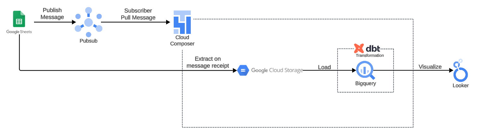
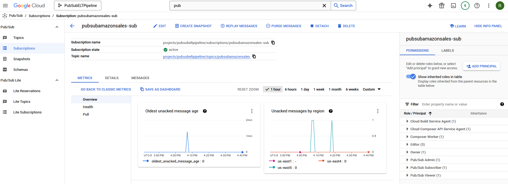

# pubsub-elt-pipeline

- The purpose of this project is to learn how to use the following tools specifically: Pub/Sub, Cloud Composer, BigQuery, DBT, and Looker Studio. 

- This project expands on my previous project "amazon-elt-pipeline" where I utilized a local csv data source, and local airflow. In this project, I import the sample amazon sales data to a Google Sheet in order to simulate a live data environment and utilize Pub/Sub to perform event driven data ingestion. In lieu of running a local Apache Airflow environment, I opted to utilize Cloud Composer. The visuals this time were recreated in Looker Studio.

- I utilized an AppsScript within the Google Sheet and created an onEdit trigger to publish a message to Pub/Sub. My Composer environment is setup to be a subscriber in this case, and the DAG within my Composer environment will pull/listen for a message from Pub/Sub. Upon receipt of a message from Pub/Sub, the data will be extracted from the sheet, loaded into BigQuery, and transformed with DBT. 

- Version control done within this GitHub repository using git add. git commit, and git push. While using .gitignore to leave out potentially sensitive data. 

- The raw data source was found on Kaggle, called "Amazon Sales Dataset EDA". 

Architecture Diagram

Amazon Sales Data on Google Sheet

AppsScript Publisher

AppsScript Trigger

Pub/Sub Published Message

Pub/Sub Subscriber ACK

Composer Environment

Composer/Airflow Graph

BigQuery

DBT Lineage Graph

Looker Studio

